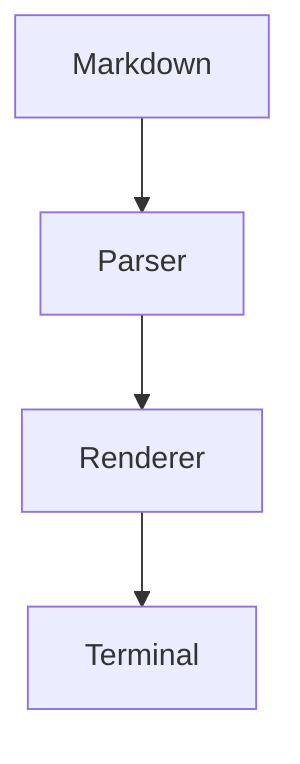
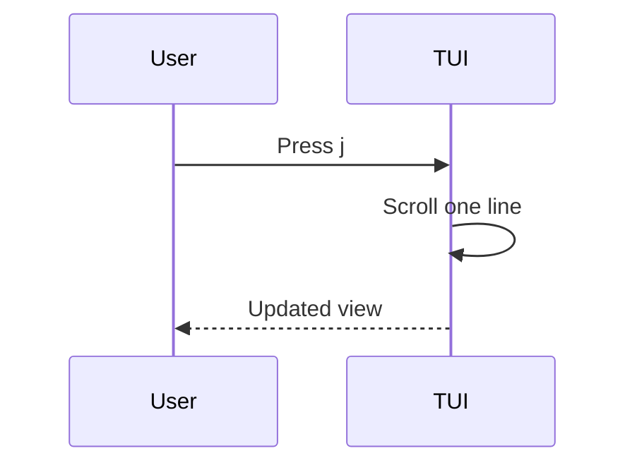

# GitHub-Flavored Markdown Feature Showcase

This file is a deliberately broad GitHub Markdown test document.

## Headings

# H1
## H2
### H3
#### H4
##### H5
###### H6

Setext H1
=========

Setext H2
---------

## Paragraphs and line breaks

A normal paragraph spans multiple source lines and should become one paragraph.
Two trailing spaces create a hard line break.  
This line follows the hard break.

A backslash creates a hard line break too.\
This line follows it.

## Emphasis

*italic*
_italic_
**bold**
__bold__
***bold italic***
___bold italic___
~~strikethrough~~

Nested: **bold with *italic* inside**, *italic with **bold** inside*, and ~~**bold strike**~~.

## Inline code

Use `inline code` and ``code containing `a backtick` ``.

## Links

[GitHub](https://github.com/)

[GitHub with title](https://github.com/ "GitHub")

<https://github.com/>

<user@example.com>

https://example.com/autolink

### Reference links

[GitHub][github]
[repository][repo]
[GitHub][]

[github]: https://github.com/
[repo]: https://github.com/Keyboard1000n17/OSPedia "OSPedia repository"

## Images


![Reference image][octocat]

[octocat]: https://github.githubassets.com/images/modules/logos_page/GitHub-Mark.png "Octocat"

## Blockquotes

> A basic blockquote.

> A blockquote can have multiple paragraphs.
>
> This is the second paragraph.

> Nested quote:
>
> > level two
> >
> > > level three

## Unordered lists

- Dash item
- Another item
  - Nested item
  - Another nested item
    - Third level

* Asterisk item
* Another asterisk item

+ Plus item
+ Another plus item

## Ordered lists

1. First
2. Second
3. Third

1. These can all
1. use the same marker
1. in source Markdown

7. Starts at seven
8. Continues at eight
9. Continues at nine

## Task lists

- [ ] Unchecked task
- [x] Checked task
- [X] Uppercase checked task
  - [ ] Nested unchecked task
  - [x] Nested checked task

## Horizontal rules

---

***

___

## Escapes

\*literal asterisks\*
\_literal underscores\_
\# literal hash
\[literal brackets\]
\`literal backticks\`
\\ literal backslash
\> literal greater-than sign
\+ literal plus
\- literal hyphen
\1. literal ordered-list-looking text

## Fenced code blocks

Plain fenced code:

```
function hello() {
  console.log("hello");
}
```

JavaScript:

```javascript
const answer = 42;
console.log(answer);
```

TypeScript:

```typescript
type User = {
  name: string;
  age: number;
};

const user: User = { name: "Ada", age: 37 };
```

Bash:

```bash
echo "Hello from Bash"
```

JSON:

```json
{
  "name": "markdown-test",
  "enabled": true,
  "items": [1, 2, 3]
}
```

Diff:

```diff
- removed line
+ added line
  unchanged line
```

Indented code:

    function indented() {
      return true;
    }

Long fence containing a fence:

````markdown
```text
inner fence
```
````

Tilde fence:

~~~python
print("tilde fences work")
~~~

## Tables

| Left | Center | Right |
| :--- | :----: | ----: |
| A | B | C |
| 1 | 2 | 3 |
| **bold** | `code` | [link](https://github.com/) |

Minimal table:

| A | B |
|---|---|
| 1 | 2 |
| 3 | 4 |

Escaped pipe:

| Expression | Meaning |
|---|---|
| `a \| b` | A literal pipe |
| A \| B | A literal pipe in source |

## Emoji

:smile: :rocket: :tada: :heart: :+1: :-1: :shipit:

Unicode emoji too: 🚀 ✨ 🐙 🎉 ❤️

## Footnotes

Here is a footnote.[^one]

Here is a named footnote.[^note]

The same footnote can be reused.[^one]

[^one]: A simple footnote.

[^note]: A footnote containing **bold**, `code`, and a [link](https://github.com/).

## HTML blocks

<!-- This HTML comment should not be rendered. -->

<div align="center">

Markdown inside HTML behavior depends on the renderer.

</div>

<details>
<summary>Expandable details</summary>

Hidden until expanded.

</details>

<table>
  <tr>
    <th>HTML</th>
    <th>Value</th>
  </tr>
  <tr>
    <td><strong>Bold HTML</strong></td>
    <td>cell</td>
  </tr>
</table>

## Inline HTML

Use <kbd>Ctrl</kbd> + <kbd>C</kbd>.

<mark>Highlighted text</mark>

<sub>subscript</sub> and <sup>superscript</sup>

A manual line break<br>inside HTML.

## GitHub alerts

> [!NOTE]
> Useful information for the reader.

> [!TIP]
> A helpful suggestion.

> [!IMPORTANT]
> Important information.

> [!WARNING]
> Warning information.

> [!CAUTION]
> Something that could cause an unwanted result.

## Math

Inline math: $E = mc^2$

Block math:

$$
\int_0^1 x^2\,dx = \frac{1}{3}
$$

Another equation:

$$
\sum_{n=1}^{\infty}\frac{1}{n^2} = \frac{\pi^2}{6}
$$

## Mermaid





## GitHub language-specific fenced blocks

```geojson
{
  "type": "Point",
  "coordinates": [51.5310, 25.2854]
}
```

```stl
solid triangle
  facet normal 0 0 1
    outer loop
      vertex 0 0 0
      vertex 1 0 0
      vertex 0 1 0
    endloop
  endfacet
endsolid triangle
```

## Character entities

&amp; &lt; &gt; &quot; &apos;

## Mixed nesting

1. **Bold list item**
   - *Italic nested item*
   - `inline code`
   - [a link](https://github.com/)
   - > nested quote
2. ~~Struck list item~~
3. [x] task-like text

## Long wrapping paragraph

GitHub-Flavored Markdown supports a large collection of Markdown constructs and GitHub extensions. This deliberately long paragraph exists to test terminal wrapping, reflow, scrolling, line measurement, and interaction with inline markup such as **bold**, *italic*, `code`, [links](https://github.com/), and emoji :rocket: across narrow and wide terminal sizes.

## Weird-but-valid inline combinations

***bold italic***, **_bold italic_**, _**italic bold**_, ~~**bold strike**~~, `code` [link](https://github.com/) and <kbd>key</kbd>.

## Everything together

> [!TIP]
> A compact integration test:
>
> - [x] **Parse** the source
> - [ ] Render the table
> - [ ] Preserve `inline code`
> - [ ] Follow [a link](https://github.com/)
>
> ```typescript
> const answer = 42;
> ```
>
> $E = mc^2$
>
> [^integration]

[^integration]: Integration-test footnote.

---

# End of Feature Showcase
